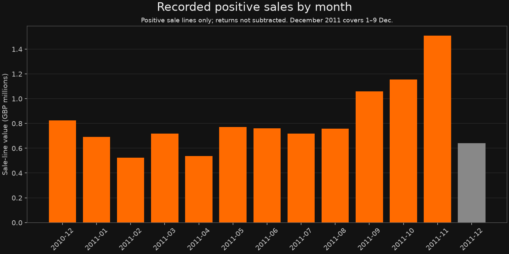
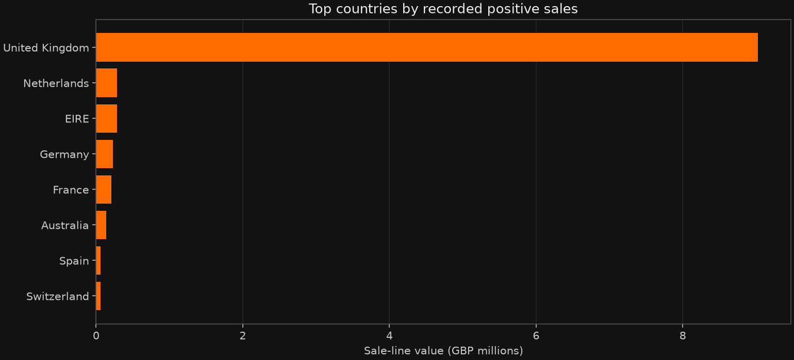

# Online Retail Sales Analysis

**Mayank Singh Sadudia · Data analysis portfolio project**

An end-to-end Python and SQL study of historical retail transactions. It demonstrates data preparation, explicit KPI definitions, SQLite aggregation, charting, and communication of findings. This is a portfolio case study; it does not claim client work or achieved business improvements.

## Questions

1. How does recorded positive sales value vary by month?
2. Which countries and stock codes contribute the most value?
3. How common is repeat purchasing among identified customers?
4. What limitations affect interpretation?

## Results

Read [FINDINGS.md](FINDINGS.md) for computed findings and caveats, or open [dashboard.html](dashboard.html) locally for the visual summary. The dashboard is a standalone file. Download it and open it in a browser.





## Reproduce

```sh
python -m venv .venv
# Activate your environment, then:
python -m pip install -r requirements.txt
python analyze.py
```

The script downloads the source archive from UCI into `.data/` on first run. You can also provide a local source workbook:

```sh
python analyze.py "path/to/Online Retail.xlsx"
```

For a step-by-step companion, open `analysis.ipynb` with Jupyter or VS Code. It uses the same documented functions and SQL queries. The saved notebook includes executed outputs.

## Files

- `analyze.py`: reproducible download, preparation, computation and charts.
- `queries.sql`: inspectable KPI, month, country, product and customer queries.
- `analysis.ipynb`: executed analytical companion.
- `report.json`: metrics, quality counts, definitions, caveats and source checksum.
- `*.csv`: aggregate query results; no individual customer IDs are published.
- `FINDINGS.md`: interpretation and limitations.
- `dashboard.html`: portable visual summary with embedded charts.

## Definitions and limitations

Recorded positive sales are `Quantity × UnitPrice` on lines with positive quantity and price whose invoice does not start with `C`. They include anonymous customers and positive service/charge lines. **This is not net revenue or profit**: returns/cancellations are excluded rather than subtracted. Exact duplicate-looking lines are retained because the dataset has no line-level unique ID.

December 2011 covers only 1–9 December. Customer metrics exclude missing IDs. Source records are from 2010–2011; they are not current business performance. Quality categories overlap, so their counts should not be added.

## Source and license

Chen, D. (2015). *Online Retail* [Dataset]. UCI Machine Learning Repository. [https://doi.org/10.24432/C5BW33](https://doi.org/10.24432/C5BW33). [Dataset page](https://archive.ics.uci.edu/dataset/352/online%2Bretail).

The source dataset and derived aggregate results use [CC BY 4.0](https://creativecommons.org/licenses/by/4.0/). Changes: filtering, aggregation, figures and narrative as documented above. The original workbook is downloaded for reproducibility and is not committed. Source code in this repository is provided for portfolio demonstration; no separate code license is granted.

[Portfolio](https://mayanksinghsadudia.github.io/mayank-portfolio/) · [GitHub profile](https://github.com/Mayanksinghsadudia)
